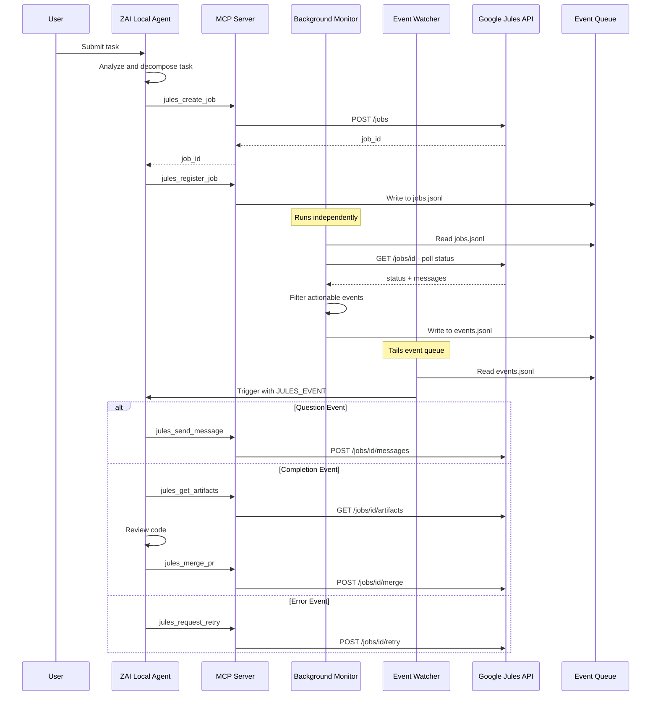
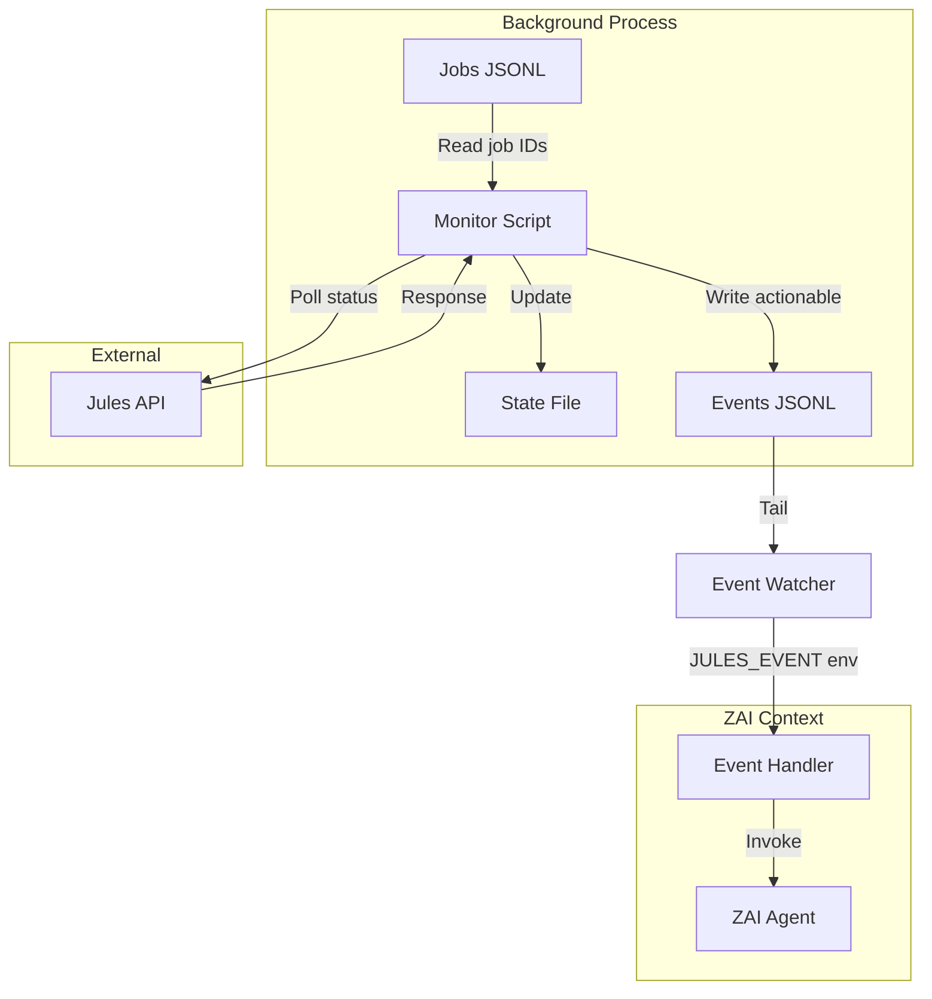
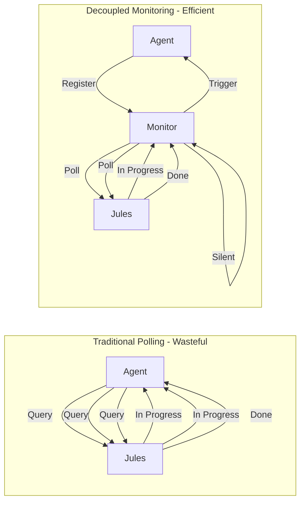

# ZAI Jules Manager - Architectural Design

## Overview

A token-efficient orchestration framework where a local coding agent (ZAI) manages a remote Google Jules agent. The system handles the full lifecycle: task decomposition, API-based dispatch to Jules, asynchronous status monitoring, intervention handling, code review, and PR merging.

**Core Constraint:** The local agent must not waste context window tokens on active polling. A decoupled monitoring mechanism handles polling independently and only triggers the local agent when human-level input or a final review is required.

---

## 1. Architectural Workflow

### Step-by-Step Interaction Loop



### Lifecycle Phases

| Phase | Description | ZAI Action | Background Process |
|-------|-------------|------------|-------------------|
| 1. Intake | Receive user task | Analyze scope, success criteria | None |
| 2. Decomposition | Break into Jules-sized work | Create subtasks, define acceptance | None |
| 3. Dispatch | Create Jules jobs | Call MCP tools, register job IDs | None |
| 4. Monitoring | Track job progress | **Idle** | Poll Jules API, filter events |
| 5. Intervention | Handle questions/stuck | Respond via MCP, update prompts | Detect stuck states |
| 6. Review | Code review on completion | Fetch artifacts, run tests | None |
| 7. Merge | Merge PR after CI passes | Call merge API, cleanup | None |
| 8. Archive | Post-merge cleanup | Close job, update tracking | None |

---

## 2. MCP Server Strategy

### Custom MCP Server Specification

#### Server Identity
- **Name:** `zai-jules-mcp`
- **Version:** `1.0.0`
- **Protocol Version:** `2024-11-05`
- **Transport:** stdio JSON-RPC

#### Tool Definitions

| Tool | Description | Parameters | Jules API Endpoint |
|------|-------------|------------|-------------------|
| `jules_create_job` | Create a new Jules job | repo, branch, prompt, constraints | POST /jobs |
| `jules_register_job` | Register job ID with monitor | job_id, jobs_path, metadata | Local file |
| `jules_get_job` | Fetch job metadata and status | job_id | GET /jobs/{id} |
| `jules_get_messages` | Fetch messages since cursor | job_id, cursor | GET /jobs/{id}/messages |
| `jules_send_message` | Send clarification to Jules | job_id, message | POST /jobs/{id}/messages |
| `jules_get_artifacts` | Get diff/patch/PR URL | job_id | GET /jobs/{id}/artifacts |
| `jules_request_retry` | Retry or re-run a job | job_id | POST /jobs/{id}:retry |
| `jules_merge_pr` | Merge PR after CI passes | job_id, payload | POST /jobs/{id}:merge |
| `jules_cancel_job` | Cancel a running job | job_id | POST /jobs/{id}:cancel |
| `jules_list_jobs` | List all jobs for a repo | repo, limit | GET /jobs |

#### Authentication
- Uses `JULES_API_TOKEN` environment variable
- Bearer token authentication in Authorization header
- Optional `JULES_API_BASE` for custom endpoints

---

## 3. Background Monitoring System

### Architecture



### Monitor Script Behavior

The monitor runs as an independent process with its own token budget:

1. **Read Jobs File:** Load active job IDs from `zai_jobs.jsonl`
2. **Poll Jules API:** Query each job status at configured interval
3. **Track State:** Maintain cursor and last-known status per job
4. **Filter Events:** Only emit actionable events
5. **Write Events:** Append to `zai_events.jsonl`

### Actionable Event Types

| Event Type | Trigger Condition | Data Included |
|------------|-------------------|---------------|
| `question` | Jules asks for clarification | job_id, message content |
| `completed` | Job status = COMPLETED | job_id, status payload |
| `error` | Job status = FAILED/ERROR | job_id, error details |
| `stuck` | No progress for N minutes | job_id, last_activity timestamp |

### Event Schema

```json
{
  "event": "question|completed|error|stuck",
  "job_id": "string",
  "observed_at": "ISO8601 timestamp",
  "status": "current job status",
  "message": "for question events - the question content",
  "payload": "full API response for context",
  "last_activity": "for stuck events - timestamp of last activity"
}
```

### Token Efficiency Mechanism



**Key Insight:** The agent only wakes when the monitor writes an actionable event. All intermediate polling happens outside the agent context.

---

## 4. Project Structure

```
zai-jules-manager/
├── README.md                    # Quick start guide
├── config.json                  # Shared configuration
├── zai_jobs.jsonl               # Active jobs registry
├── zai_events.jsonl             # Actionable event queue
├── docs/
│   └── architecture.md          # This document
├── mcp-server/
│   ├── jules_mcp_server.py      # MCP server implementation
│   └── README.md                # MCP server docs
└── scripts/
    ├── jules_monitor.py         # Background poller
    ├── jules_event_watcher.py   # Event queue watcher
    ├── zai_event_handler.py     # ZAI-specific handler
    └── mcp_client.py            # CLI MCP client helper
```

---

## 5. Configuration Schema

```json
{
  "jobs_path": "zai-jules-manager/zai_jobs.jsonl",
  "events_path": "zai-jules-manager/zai_events.jsonl",
  "monitor_state_path": "zai-jules-manager/.zai_monitor_state.json",
  "watcher_state_path": "zai-jules-manager/.zai_watcher_state.json",
  "monitor_poll_seconds": 45,
  "watcher_poll_seconds": 1,
  "stuck_minutes": 20,
  "api_base": "https://jules.googleapis.com/v1",
  "mcp_command": ["python", "zai-jules-manager/mcp-server/jules_mcp_server.py"],
  "zai_command": ["zai", "handle-event"]
}
```

---

## 6. Implementation Artifacts

### 6.1 MCP Server (jules_mcp_server.py)

A minimal stdio JSON-RPC server that:
- Implements MCP protocol handshake
- Exposes Jules API tools
- Handles authentication via environment
- Returns structured responses

### 6.2 Background Monitor (jules_monitor.py)

A long-running Python script that:
- Loads configuration from config.json
- Reads active jobs from zai_jobs.jsonl
- Polls Jules API at configured interval
- Maintains state in .zai_monitor_state.json
- Writes actionable events to zai_events.jsonl

### 6.3 Event Watcher (jules_event_watcher.py)

A file-tailing script that:
- Monitors zai_events.jsonl for new entries
- Invokes handler command with JULES_EVENT env var
- Tracks read offset in .zai_watcher_state.json

### 6.4 ZAI Event Handler (zai_event_handler.py)

The ZAI-specific handler that:
- Reads JULES_EVENT from environment
- Routes to appropriate handler based on event type
- Invokes MCP tools for Jules interaction
- Returns control to ZAI main context

---

## 7. Usage Flow

### Starting the System

```bash
# Terminal 1: Start MCP server (if needed for direct calls)
python zai-jules-manager/mcp-server/jules_mcp_server.py

# Terminal 2: Start background monitor
python zai-jules-manager/scripts/jules_monitor.py --config zai-jules-manager/config.json

# Terminal 3: Start event watcher
python zai-jules-manager/scripts/jules_event_watcher.py --command "python zai-jules-manager/scripts/zai_event_handler.py"
```

### ZAI Agent Workflow

```python
# In ZAI context - creating a job
result = mcp_call("jules_create_job", {
    "repo": "owner/repo",
    "branch": "feature/new-auth",
    "prompt": "Implement OAuth2 authentication"
})
job_id = result["job_id"]

# Register for monitoring
mcp_call("jules_register_job", {
    "job_id": job_id,
    "jobs_path": "zai-jules-manager/zai_jobs.jsonl",
    "metadata": {"task": "OAuth2 implementation"}
})

# ZAI can now context-switch away - monitor handles polling
# When actionable event occurs, handler invokes ZAI
```

---

## 8. Error Handling

| Scenario | Detection | Recovery |
|----------|------------|----------|
| API rate limit | HTTP 429 | Exponential backoff in monitor |
| Auth failure | HTTP 401 | Log error, emit error event |
| Network timeout | Request timeout | Retry with backoff, emit error after N retries |
| Invalid job ID | HTTP 404 | Remove from jobs file, emit error |
| Stuck detection | No status change for N min | Emit stuck event for intervention |

---

## 9. Security Considerations

- **API Token:** Stored in environment, never in files
- **Job Files:** Contain only job IDs and metadata, no secrets
- **Event Files:** Contain only status data, no sensitive info
- **MCP Transport:** stdio only, no network exposure

---

## 10. Future Enhancements

1. **Webhook Support:** If Jules adds webhooks, replace polling with push
2. **Multi-repo Support:** Aggregate jobs across repositories
3. **Priority Queue:** Allow job prioritization in monitor
4. **Metrics Dashboard:** Expose Prometheus metrics for monitoring
5. **Distributed Mode:** Support multiple monitor instances with coordination
